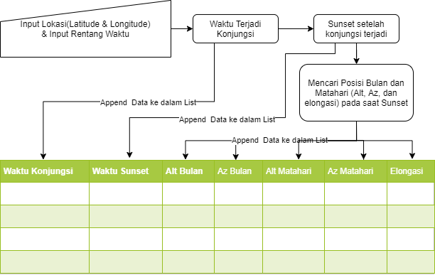

# Prediksi-Hilal
 Prediksi hilal dari suatu lokasi pada rentang waktu yang diberikan.

___
Program ini menggunakan Python Package: [Skyfield](https://rhodesmill.org/skyfield/).
Program ini dibuat dengan ketentuan sebagai berikut:
- Ephemeris:
    > Ephemeris yang digunakan adalah de421.bsp
- Definisi Matahari Terbenam:
    > Skyfield menggunakan definisi resmi matahari terbit dan terbenam dari United States Naval Observatory, yang mendefinisikan matahari terbenam ketika pusat matahari adalah <b>0,8333</b> derajat di bawah Horizon, untuk memperhitungkan rata-rata jari-jari Matahari dan untuk rata-rata pembiasan atmosfer di horizon.
___
- Flowchart:
 

 
- Input Lokasi berupa Latitude dan Longitude dalam bentuk <em>Decimal Degree</em> dengan format String / text.
 > Contoh : 
    Latitude: "7.83305556 S"
    Longitude: "110.38305556 E"
    Perhatikan Notasi "S" dan "E" bergantung pada lokasi.
    
- Input waktu berupa tanggal rentang waktu hilal yang ingin dicari.
 > Contoh dari tanggal 1 Januari 2020, sampai 1 Januari 2021
___

### Kriteria Hilal
- Imkanur Rukyat
    > - Pada saat matahari terbenam, <b>ketinggian bulan minimal 2$^\circ$</b>, <b>Elongasi minimal 3$^\circ$</b>.
    > - Pada saat Bulan terbenam, usia bulan minimal <b>8 Jam</b>, dihitung sejak ijtima' (konjungsi)
    
___